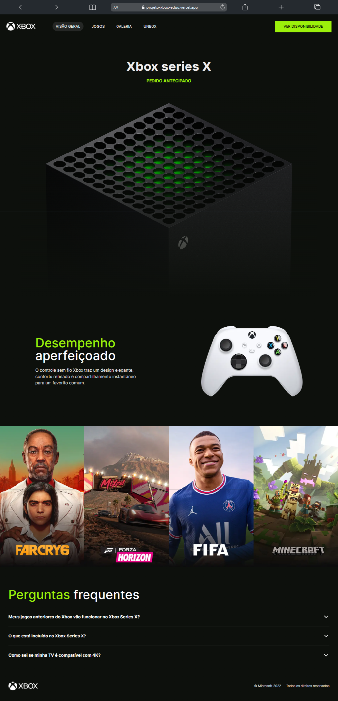

<h1 align="center" style="font-weight: bold;">Projeto Xbox 💻</h1>

<p align="center">
 <a href="#technologies">Technologies</a> • 
 <a href="#started">Getting Started</a> • 
  <a href="#colab">Collaborators</a> •
 <a href="#contribute">Contribute</a>
</p>

<p align="center">
    <b>Apresentação visualmente atraente do Xbox Series X, criada com HTML, CSS e JavaScript.</b>
</p>

<p align="center">
     <a href="https://projeto-xbox-eduu.vercel.app/">📱 Visite meu Projeto</a>
</p>

<h2 id="layout">🎨 Layout</h2>

<p align="center">
    
</p>

<h2 id="technologies">💻 Technologias</h2>

- Next.js
- Tailwind CSS
- Typescript
- Flexbox

<h2 id="started">🚀 Começando</h2>

Execute esse codigo no terminal para começar esse projeto 
```bash
npm run dev
```

<h3>Pré-requisitos</h3>

Pré-requisitos ter o nodejs e o git instalados em sua maquina 

- [NodeJS](https://nodejs.org/pt)
- [Git](https://git-scm.com/downloads)


<h3>Clonagem</h3>

Como clonar meu projeto execute esse codigo no terminal

```bash
git clone https://github.com/eduardomendes117/projeto-xbox
```
 
